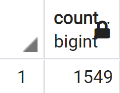
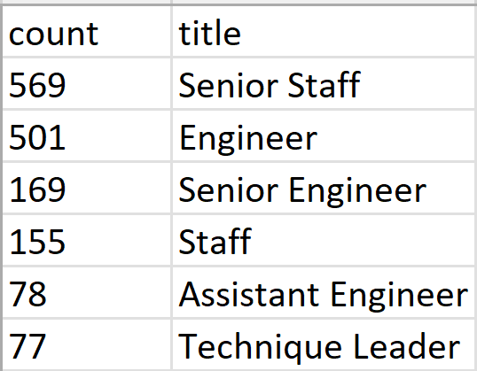

# Pewlett Hackard Analysis

## Overview: 

Pewlett Hackard anticipates a large number of its employees to be retiring over the next few years. The management team wants to know the number of retiring employees per title, and identify employees who are eligible to participate in a mentorship program to help train the next generation of Pewlett Hackard employees. A "silver tsunami" refers to the large number of aging seniors in many world economies. This analysis was conducted to help Pewlett Hackard prepare for the potential "silver tsunami" coming to for their company.

## Results: 

* The following table is a snippet of the list of employees in the Pewlett Hackard datebase born between 1952 and 1955. This table needed to be modified because it included employees that no longer work for the company. 

* The following table is a snippet of the list of eligible for retirement born between January 1, 1952 and December 31, 1955 and are current employees at Pewlett Hackard. Additionally, any duplicate employee numbers were removed so that only the most current job title associated with an individual is displayed.

* The following is a table of the count of individials from each department eligible for retirement in the next few years. 

* The following is a snippet of the table of those eligible to partake in a mentorship program. Those eligible must be current employees born between January 1, 1965 and December 31, 1965.

## Summary: 

I conducted a query to total the number of employees eligible for retirement and discovered a total of 72,458. This means 72,458 roles from different departments will evnetually need to be filled. 

I conducted a query to count the number of qualified mentors and there are only 1,549. 

The following is a table of the count of individials from each department eligible for the mentorship program.

 

There is clearly not enough individuals eligible for the mentorship program to train the amount of people needed to fill all the open positions that will soon become available. Other plans need to be put in place to properly staff and train the new (and large) incoming group of new staff. 
